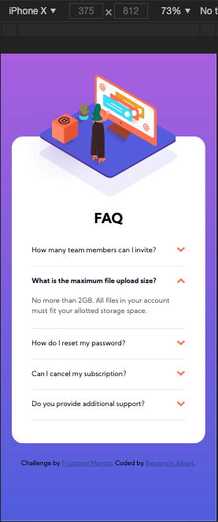
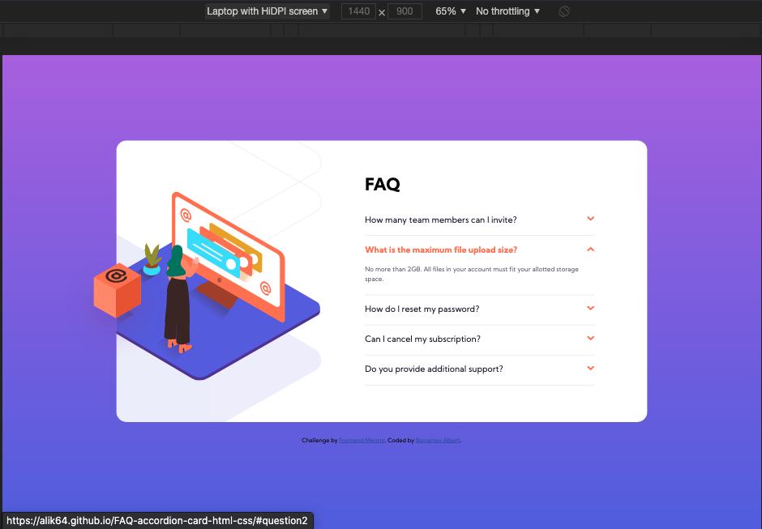

# FAQ-accordion-card

My second Frontend Mentor Challenge
# Frontend Mentor - FAQ accordion card solution

This is a solution to the [FAQ accordion card challenge on Frontend Mentor](https://www.frontendmentor.io/challenges/faq-accordion-card-XlyjD0Oam)

## Table of contents

- [Overview](#overview)
  - [The challenge](#the-challenge)
  - [Screenshot](#screenshot)
  - [Links](#links)
- [My process](#my-process)
  - [Built with](#built-with)
  - [What I learned](#what-i-learned)
  - [Continued development](#continued-development)
- [Author](#author)
- [Acknowledgments](#acknowledgments)


## Overview

### The challenge

Users should be able to:

- View the optimal layout for the component depending on their device's screen size
- See hover states for all interactive elements on the page
- Hide/Show the answer to a question when the question is clicked

### Screenshot





### Links

- [Solution URL](https://alik64.github.io/CSS_HTML/)


## My process

### Built with

- Semantic HTML5 markup
- CSS custom properties
- Flexbox


### What I learned

Upgrated this challenge by using JavaScript:


```js
const liens = document.querySelectorAll('.accordion_link')
const arrow = document.querySelectorAll('.arrow')
console.log(liens)
console.log(arrow)


 
liens.forEach(element => {
    element.addEventListener('click',function(){
        const answer = this.parentNode.childNodes[3]
        const arrowParent = this.parentNode.childNodes[1]
        const arrow = arrowParent.firstElementChild
       answer.classList.toggle('open')
       arrow.classList.toggle('reversed')
    })
})
```


### Continued development

Next step for me wiil be using a JavaScript for the same challenge.


## Author
- Twitter [@al_B_rt](https://twitter.com/al_B_rt)


