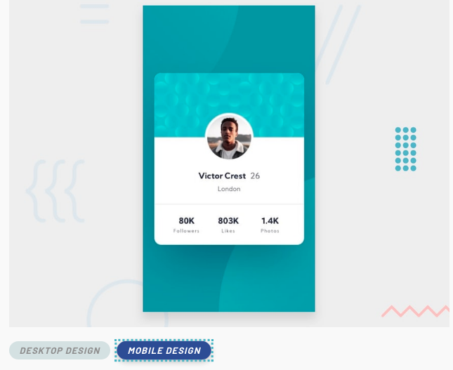

# ProfileCard
My first "frontEndMentor" project.

This is a solution to the [Profile card component challenge on Frontend Mentor](https://www.frontendmentor.io/challenges/profile-card-component-cfArpWshJ).

## Table of contents

- [Overview](#overview)
  - [The challenge](#the-challenge)
  - [Screenshot](#screenshot)
  - [Links](#links)
- [My process](#my-process)
  - [Built with](#built-with)
  - [What I learned](#what-i-learned)
  - [Continued development](#continued-development)
  - [Useful resources](#useful-resources)
- [Author](#author)


## Overview

### The challenge

Build out this profile card component and get it looking as close to the design as possible.

Desktop design : 


Mobile design :


### Screenshot


### Links
- [Solution URL](https://alik64.github.io/CSS_HTML/ProfileCard/)

## My process

### Build with

- CSS custom properties
- Flexbox
- Mobile-first workflow

### What i learned

- Using "clamp" function for select a range of values of width.

```css
.card {
  width: clamp(320px, calc(50vh - 100px), 400px);
};
```

- Using "translate" CSS function for repositions elements in the horizontal and vertical directions.
```css

.top {
    transform: translate(-61%, -61%);
  };
```
### Continued development

In my future prohjects i would like to refine and perfect my skills using "position" in CSS (Ex.absolute, relative) and also responsive design.

### Useful resources

- [GrafikArt](https://grafikart.fr) - This site help me to understand HTML and CSS, with a lot of tutorials and information.
- [MDN Web Docs](https://developer.mozilla.org/en-US/) - This site is essential to study.
- [freeCodeCamp](https://www.freecodecamp.org) - A lot of tutorials and exercises to understand HTML and CSS, and Web Development.

## Author

- Twitter [@al_B_rt](https://twitter.com/al_B_rt)


